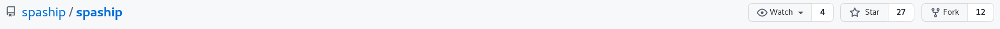
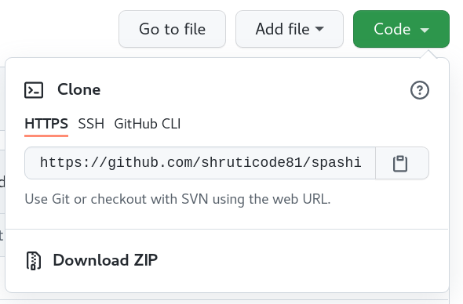
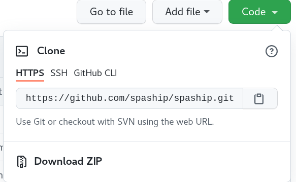
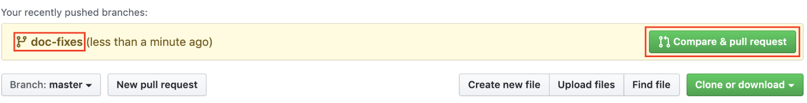
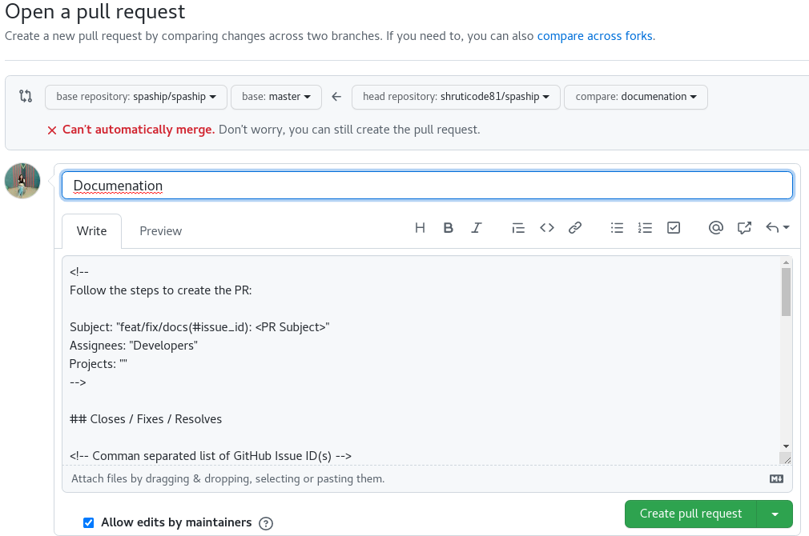

## What is Open Source? :trophy:

>If you're a developer, you've probably come across the term **"open source."** If you've ever wondered what it's all about and how to contribute, you are in exactly the right place.

Open source refers to source code that is made available to the public to view, use, modify, and distribute under a permissive license.
Contributing to open source can be a rewarding way to learn, teach, and build experience in just about any skill you can imagine.
The main point of  open source projects is to create valuable and accessible open source software, individual contributors can get plenty of personal benefit from contributing to them.

Some popular Open-Source Software are the Linux Operating System, Android, Mozilla Firefox, Chromium (which powers Google Chrome and Microsoft Edge), VSCode IDE, VLC Media Player, WordPress Content Manager System, etc. 

## Why contribute to open source? :mag_right:
Contributing to open source projects can be a rewarding way to learn, teach, share, and build experience. There are plenty of reasons why you should contribute to an open source project, such as:
* To improve the software you rely on daily
* To find a mentor if you need one
* To try out & learn new skills (personal favourite :wink:)
* To share your skills
* To gain a much deeper knowledge about the software you're using
* To build up your reputation and help grow your career
* It feels good to give back to a project that you use!
* Plus, it's fun and gives you personal satisfaction

:::info

As SPAship is Opensource , SPAship team is on a mission to make *[SPAship](https://github.com/spaship/spaship)* popular among the opensource community.

:::

## What to Know Before You Contribute to an Open Source Project ? :bookmark_tabs:
Every open source community is different. Each community has different people in it with different roles and rewards offered. 
### A typical open source project will have these people :
- **Author** - This is the person who created the project. They have the power to assign new roles to other members to help with the project's maintenance.
- **Owner** - The ownder has administrative ownership of the project (and can be the same person as the author)
- **Maintainers** - These people are responsible for driving the vision and goals of the project. They're usually people who feel responsible for the direction of the project and who are committed to improving it
- **Contributors** - Contributors add to the project in one way or another. They follow the same code review process, are subject to the same requirements on code style, and so on.
Community Members/Users - These valuable members of the community can provide feedback about features, bug reports, and more.

## How to submit a contribution ? :bulb:
Contributing to open source project can be intimidating and confusing at beginner level. To add to that, most large open source projects have a steep learning curve .
So Don't worry :innocent: 

This article will walk you through the step by step process how you can contribute to **[SPAship monorepo](https://github.com/spaship/spaship)** or any opensource project in general.

### **Step 1 : Sign into GitHub** 

Sign into your GitHub account, or [create a free GitHub account](https://github.com/) if you don't have one.

### **Step 2 : Opening an issue**
You should usually open an issue in the following situations:

- Report an error you can’t solve yourself
- Discuss a high-level topic or idea (for example, community, vision or policies)
- Propose a new feature or other project idea
Tips for communicating on issues:

- If you see an open issue that you want to tackle, comment on the issue to let people know you’re on it. That way, people are less likely to duplicate your work.
- If an issue was opened a while ago, it’s possible that it’s being addressed somewhere else, or has already been resolved, so comment to ask for confirmation before starting work.
- If you opened an issue, but figured out the answer later on your own, comment on the issue to let people know, then close the issue. Even documenting that outcome is a contribution to the project.

Incase you found an issue in SPAship project and capable of resolving it pls follow next step3 :)

### **Step 3 : Fork the project repository**
Fork the SPAship monorepo - <https://github.com/spaship/spaship>. At the top right corner, you will see the term "fork". All you need to do is click it and you will have created a copy of the same project in your account. The URL will change to:
<https://github.com/YourUserName/spaship>

# 

### **Step 4 : Clone your fork**
While still in your repository, click the green Clone or download button and then copy the HTTPS URL:

# 
Using Git on your local machine, clone your fork using the URL you just copied: git clone URL_OF_FORK.

For example, I used git clone <https://github.com/shruticode81/spaship>.

Cloning copies the repository files (and commit history) from GitHub to your local machine. The repository will be downloaded into a subdirectory of your working directory, and the subdirectory will have the same name as the repository.

### **Step 5 : Navigate to your local repository**
Since the clone was downloaded into a subdirectory of your working directory, you can navigate to it using: cd NAME_OF_REPOSITORY.

For example, I used cd spaship.

### **Step 6 : Check that your fork is the "origin" remote**
You are going to be synchronizing your local repository with both the project repository (on GitHub) and your fork (also on GitHub). The URLs that point to these repositories are called "remotes". More specifically, the project repository is called the "upstream" remote, and your fork is called the "origin" remote.

When you cloned your fork, that should have automatically set your fork as the "origin" remote. Use git remote -v to show your current remotes. You should see the URL of your fork (which you copied in step 3) next to the word "origin".

If you don't see an "origin" remote, you can add it using: git remote add origin URL_OF_FORK.

### **Step 7 : Add the project repository as the "upstream" remote**
Go to your fork on GitHub, and click the "forked from" link to return to the project repository: 
<https://github.com/spaship/spaship>
While in the project repository, click the green Clone or download button and then copy the HTTPS URL:
# 
Add the project repository as the "upstream" remote using: git remote add upstream URL_OF_PROJECT.

For example, I used git remote add upstream https://github.com/spaship/spaship.git.
Use git remote -v to check that you now have two remotes: an origin that points to your fork, and an upstream that points to the project repository.

### **Step 8 : Pull the latest changes from upstream into your local repository**
Before you start making any changes to your local files, it's a good practice to first synchronize your local repository with the project repository. Use git pull upstream master to "pull" any changes from the "master" branch of the "upstream" into your local repository. (If the project repository uses "main" instead of "master" for its default branch, then you would use git pull upstream main instead.)

If you forked and cloned the project repository just a few minutes ago, it's very unlikely there will be any changes, in which case Git will report that your local repository is "already up to date". But if there are any changes, they will automatically be merged into your local repository.

### **Step 9 : Create a new branch**
Rather than making changes to the project's "master" branch, it's a good practice to instead create your own branch. This creates an environment for your work that is isolated from the master branch.

Use git checkout -b BRANCH_NAME to create a new branch and then immediately switch to it. The name of the branch should briefly describe what you are working on, and should not contain any spaces.

For example, I used git checkout -b doc-fixes because I was making some small fixes to the documentation.

Use git branch to show your local branches. You should see your new branch as well as "master", and your new branch should have an asterisk next to it to indicate that it's "checked out" (meaning that you're working in it).

### **Step 10 : Make changes in your local repository**
Use a text editor or IDE to make the changes you planned to the files in your local repository. Because you checked out a branch in the previous step, any edits you make will only affect that branch.

### **Step 11 : Commit your changes**
After you make a set of changes, use git add -A to stage your changes and git commit -m "DESCRIPTION OF CHANGES" to commit them.

For example, I used git commit -m "fix typos in set_config docstring" for one of my commits.

If you are making multiple sets of changes, it's a good practice to make a commit after each set.

### **Step 12 : Push your changes to your fork**
When you are done making all of your changes, upload these changes to your fork using git push origin BRANCH_NAME. This "pushes" your changes to the "BRANCH_NAME" branch of the "origin" (which is your fork on GitHub).

For example, I used git push origin doc-fixes.

### **Step 13 : Begin the pull request**
Return to your fork on GitHub, and refresh the page. You may see a highlighted area that displays your recently pushed branch:
# 
Click the green Compare & pull request button to begin the pull request.

(Alternatively, if you don't see this highlighted area, you can switch to your branch using the Branch button and then click the New pull request button.)

### **Step 14 : Create the pull request**
When opening a "pull request", you are making a "request" that the project repository "pull" changes from your fork. You will see that the project repository is listed as the "base repository", and your fork is listed as the "head repository".

# 

Before submitting the pull request, you first need to describe the changes you made (rather than asking the project maintainers to figure them out on their own). You should write a descriptive title for your pull request, and then include more details in the body of the pull request. If there are any related GitHub issues, make sure to mention those by number. The body can include Markdown formatting, and you can click the Preview tab to see how it will look.

Below the pull request form, you will see a list of the commits you made in your branch, as well as the "diffs" for all of the files you changed.

If everything looks good, click the green Create pull request button!

### **Step 15 : Review the pull request**
Soon the maintainer will merge all your changes into the master branch of this project (unless they need changes from you). You will get a notification email once the changes have been merged.

## **Congratulations!**

Congratulations on making your first open source contribution to SPAship project! :tada: If you ran into any unexpected problems, I'd love to hear about it so that I can continue to improve this guide.

