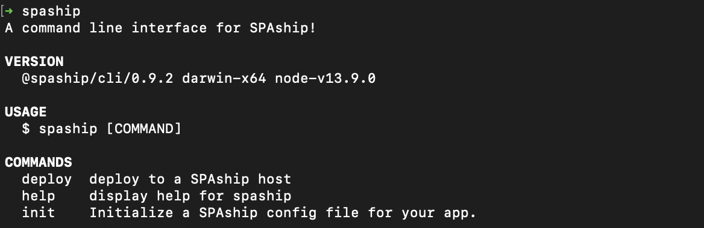
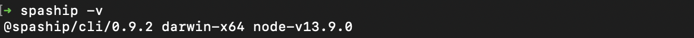
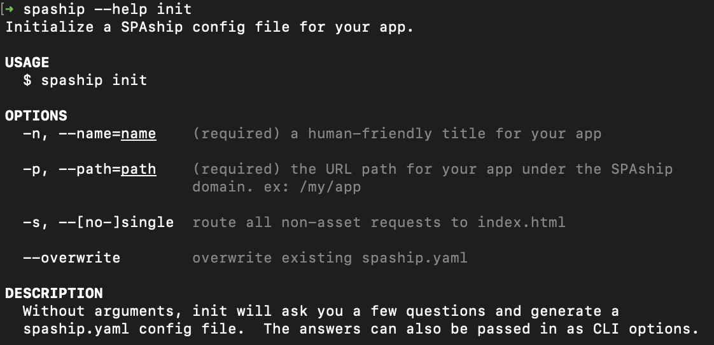
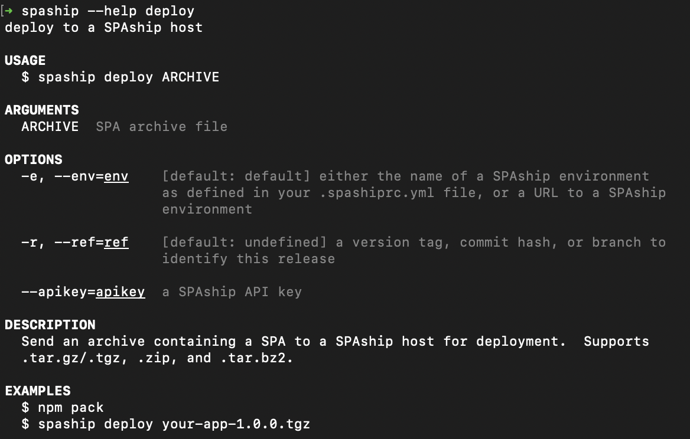
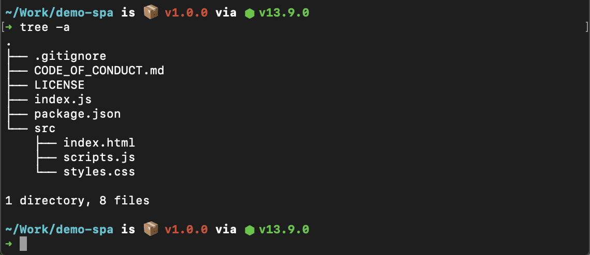
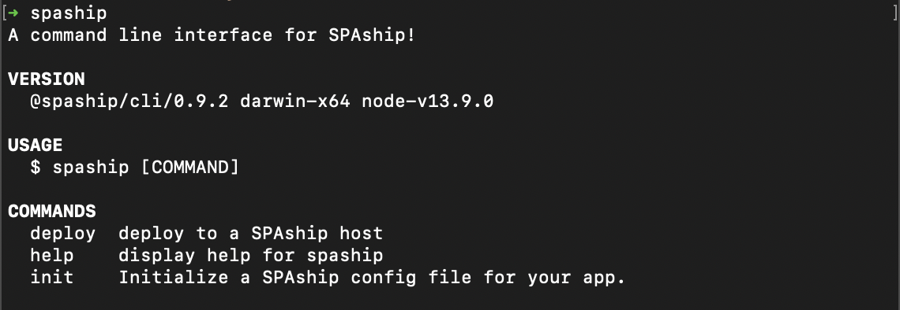
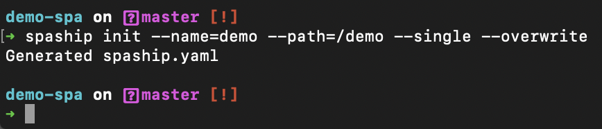
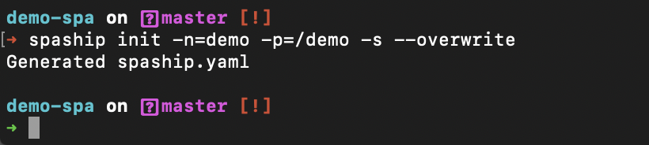
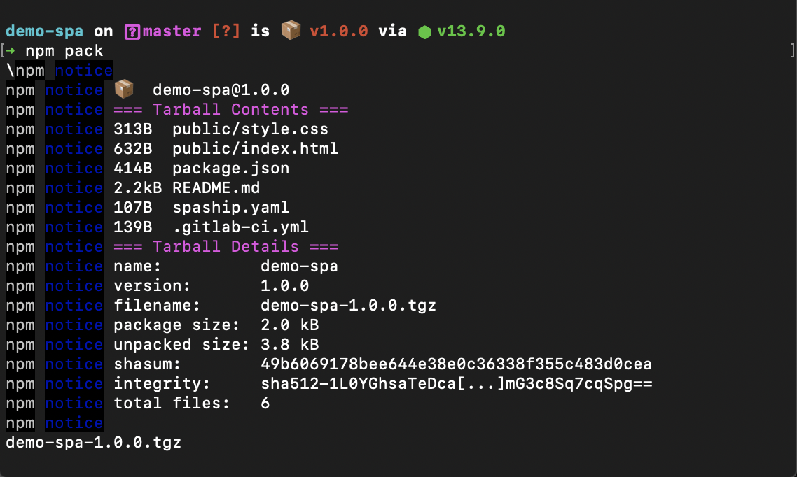
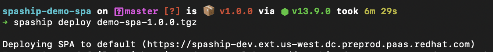

One of the most handy tools of the SPAship toolchain is the [**SPAship CLI**](https://github.com/spaship/spaship/tree/master/packages/cli). 

SPAship is build from scratch with an idea that developers at RedHat can deploy and manage SPAs in any redhat customer portal website/muilti-level websites.But it being open source any organization can get benefits of it. It provides you with some of the most simple yet developer friendly means to initialize and deploy your SPAs to your portal. 

## Prerequisites of SPAship CLI:

You would need [NodeJS](https://nodejs.org/en/download/) and NPM installed on your local system.
- [Node.js](https://nodejs.org/en/download/) version >= 12.13.0 or above (which can be checked by running node -v).
- NPM >= 6 or above

## Installation of SPAship cli :
To install the SPAship Command Line Interface on your local system run :

**$ npm install -g @spaship/cli**
:::note

The  -g  flag installs the CLI globally (accessible from any directory via the command line). To install it under a local directory, simply remove the  -g  flag.

:::

Once you have the SPAship CLI installed you would be one step closer to SPA Deployment. Let have a look at CLI commands to help you get started :
- To see an overview of the SPAship CLI run: **$ spaship**
# 

- To check which version of the SPAship CLI is currently running: **$ spaship (-v|--version|version)**
# 

- To see detailed information about any command: **$ spaship --help [COMMAND]**
# 
# 


## SPA initialization :
Getting Started:

For this demo, let’s consider the example of an open source NodeJS project consisting of a demo single page application which we would be initializing and deploying via SPAship. 
We would be using a generic SPA repository for this example with the following directory structure. If you are interested in learning how we scaffolded it you can check the document linked [here](https://docs.google.com/document/d/1MsHp8runNJbSNiame8Za5NccEVG9M8jGnh7MydPqR-0/edit).

# 


If we want to deploy the above SPA at a particular path (/demo) within an existing portal.We have to init the spaship.Now this path for SPA doesn't exists.
### spaship init:
The first step to getting started with SPAship is the **spaship init** command. Executing it without any arguments invokes an interactive prompt which will ask you a few questions and generate a spaship.yaml config file. This command must be executed within the SPA folder using cli . The answers to these questions can also be passed in as CLI arguments while executing the command. Here’s a screenshot of the command’s help description:

# 

There are 3 ways to use the SPAship CLI to initialize a new SPA with the **spaship init** command, these are:

- Using the interactive mode:
# 
- Using long parameters: 
# 
- Using short parameters:
# 

**Note** -  The --overwrite flag used in the last two examples is used only when your project already has an existing spaship.yaml file, which we want to overwrite.
Run ***cat spaship.yaml*** command to view the content . spaship.yaml file contains the info which developer entered about the SPA in spaship init command.

## Packaging SPA:
Before using the deploy command the first thing that you need is a package containing your SPA. We can use **npm pack** command.
npm pack is built into npm , all it does is it pacakges up your spa and make it ready for deployment.

# 

This command will return an archive file with extension  .tar.gz/.tgz 

## spaship deploy:
The spaship deploy command allows you to deploy your application to a SPAship host. It works by sending an archive containing a SPA to a SPAship host for deployment. At the moment, the CLI supports .tar.gz/.tgz, .zip, and .tar.bz2 archives.

The next step after packaging would be to execute the spaship deploy command to actually deploy your application to a SPAship host. However, prior to running this command, it's highly recommended that you have your **spashiprc configured**. Please refer to the below [Setting up .spashiprc.yml](##Setting-up-spashiprc.yml). Another important requirement for this step is the API Key required for the deployment. You can create a new API Key by using the SPA Manager’s Authentication section.
Once you have your spashiprc file configured, deploying your application is as easy as running : 

**$ spaship deploy demo-spa-1.0.0.tgz** 

Internally, this command translates to:

**curl `<hostname>`/api/v1/applications/deploy -H 'X-API-Key: `<API-Key>`' -F name=Demo SPA -F path=demo -F upload=@demo-spa-1.0.0.tgz -F ref=v1.0**

# 

## Setting up spashiprc.yml
spashiprc is a yaml dot file in your **$HOME** directory that is used by SPAship to provide an alternative to typing out **--apikey `<KEY>`** and **--env `<URL>`** arguments every time you run spaship commands. You can use a spashiprc file to define an environment name (like **qa,dev,prod**) along with its URL and API key, after which you can run ***spaship deploy --env qa***. The URL and API key will be read from your spashiprc file.

:::info

spashiprc files are optional, but very convenient if you plan to do deployments from your dev environment. If your deployments are done by a CI/CD server, you probably don't need a spashiprc file and will be better off using ***--env URL*** and ***--apikey KEY***.

:::
:::note

**Important:** As a rule of thumb, spaship.yaml files are consumed by the SPAship API, whereas spashiprc files are consumed by the CLI.

:::

### **spashiprc file demo:**
- #### <u>spashiprc with default environment</u>:
    
    This spashiprc file defines a default environment which will be used whenever **--env** is not provided.
    
    **.spashiprc.yml**

    ```yml
    envs:
    default:
        url: https://localhost:8008
        apikey: 57d5c061-9a02-40fc-a3e4-1eb3c9ae6a12
    ```

    **.spashiprc.yml**

    ```yml
    envs:
    default:
        url: https://localhost:8008
        apikey: 57d5c061-9a02-40fc-a3e4-1eb3c9ae6a12
    qa:
        url: https://qa.mysite.com:8008
        apikey: 57d5c061-9a02-40fc-a3e4-1eb3c8ae2a45
    ```
    Now when you run **spaship** commands, the **--env** flag is optional. When it's omitted, the default environment will be used.

    ```sh
    spaship deploy MyProject-1.0.0.tgz
    ```
- #### <u>spashiprc layering example</u>:
    **\$HOME/.spashiprc.yml**

    ```yml
    envs:
    qa:
        apikey: 57d5c061-9a02-40fc-a3e4-1eb3c9ae6a12
    prod:
        apikey: 70f19422-bf53-44b1-b664-f9b4636bea61
    ```

    **\$HOME/projects/MyProject/.spashiprc.yml**

    ```yml
    envs:
    qa:
        url: https://qa.spaship.io
    prod:
        url: https://spaship.io
    ```

    When you run spaship commands from within \$HOME/projects/MyProject, _both_ of the above _spashiprc_ files will be loaded and merged together, forming a complete definition of URL+API key for each environment.
    
    Such as:

    ```sh
    cd $HOME/projects/MyProject
    spaship deploy --env prod MyProject-1.0.0.tgz