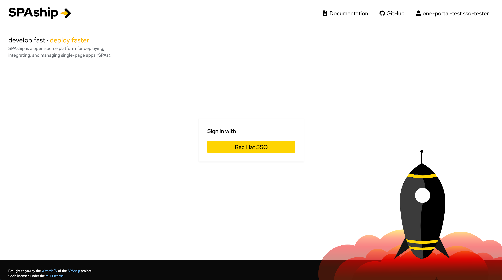
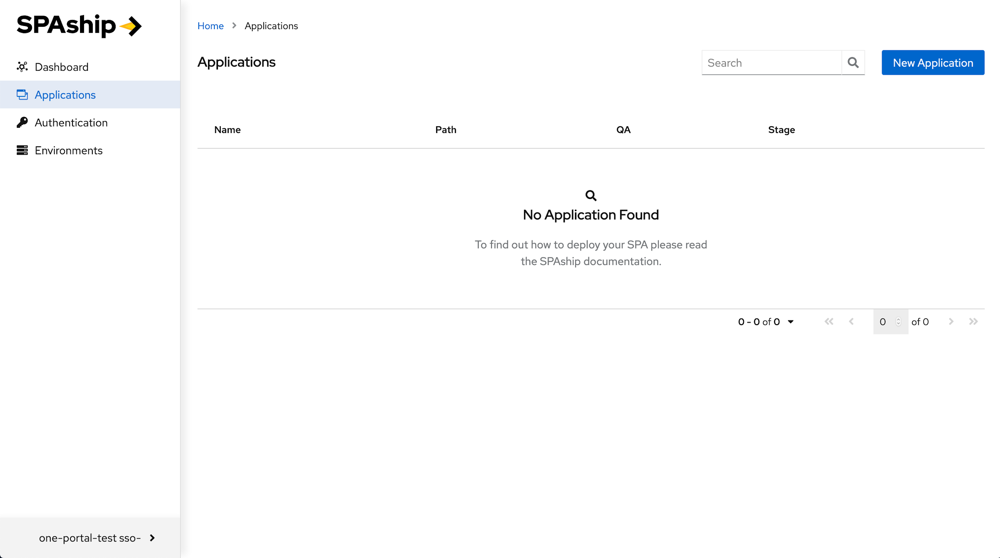
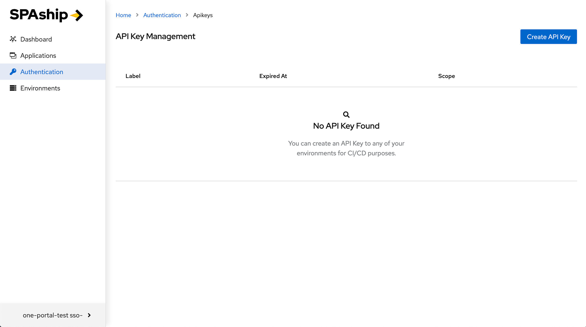
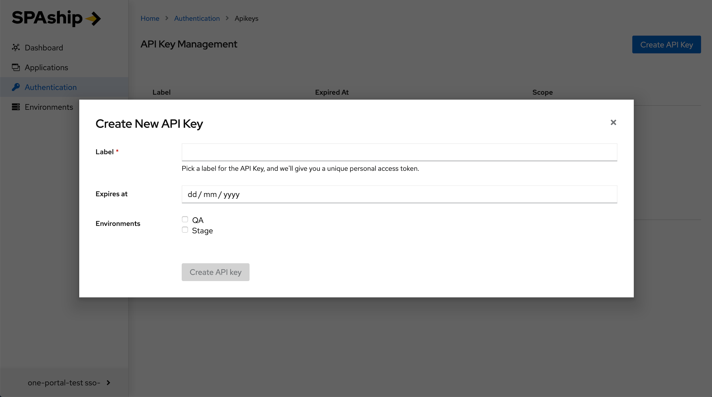
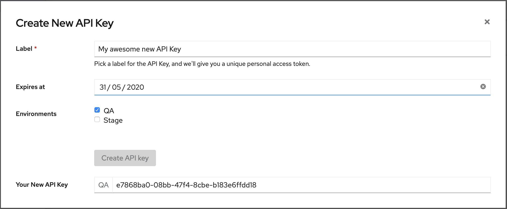
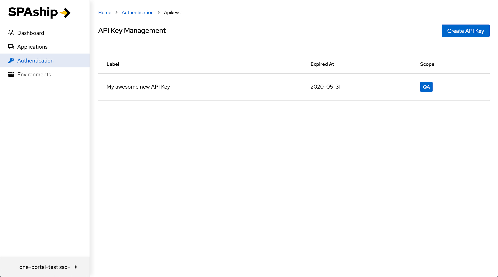
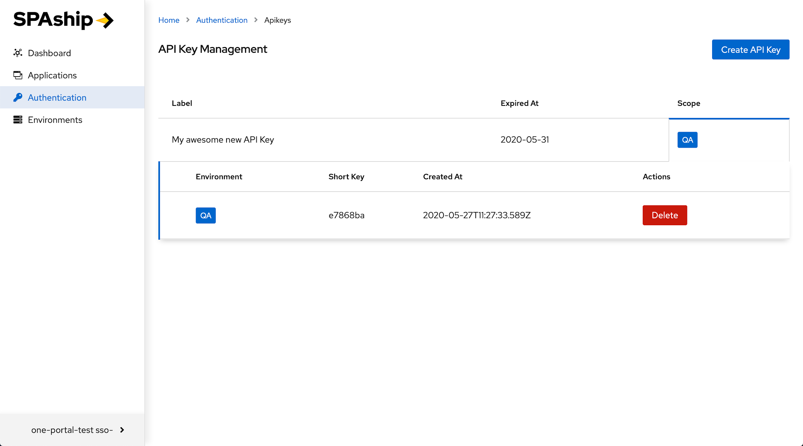

SPAship Manager is **user interface** for managing your ***API Keys*** and ***Applications*** deployed.

### SPAship user can follow below steps inorder to get clarity about SPAship Manager :

#### **Step 1: Registering as a SPAship user**
Ensure that you have access to the ***‘spaship-users’*** rover group before getting started with using any Red Hat internal preset SPAship instance. If you are not already in the group and for some reason are not able to join the group yourself, please drop in an email to <spaship-dev@redhat.com>

#### **Step 2: Logging in**
By default, when you try to access the SPA Manager, SPAship will try to automatically log you in using the pre-configured Single Sign On (SSO) service. However, depending upon how your instance is configured, trying to access the SPA Manager can also open up the /login page.

Image 1: SPAship Manager Login Page

Here, you can click upon the Sign in with SSO button to directly log into the SPAship Manager interface. However, you can checkout [SPAship’s GitHub repository](https://github.com/spaship/spaship) if you are curious to check out the SPAship source code.

Image 2: SPAship Applications List Page

Once logged in, you should be redirected to the ***Applications list page*** as shown in above fig. Any SPAs that have already been deployed should show up on this page. In case there are no SPAs present, the page would show an empty table with the message **"No Application Found"**.

#### Step 3: Creating an API Key

Once you are logged into the SPA Manager, the next thing that you need to do would be to create an API Key for all the environments *(dev,qa,stage,prod)* that you want to be able to deploy your application to. To do this, first click on the **"Authentication"** link on the left nav bar. This would open up the API Key Management page.

Image 3: SPAship API Key Management Page

To create your first API Key, click the **"Create API Key"** Button on the top right corner of the page. This should open up a modal asking you to enter some basic details about the API Key.

Image 4: SPAship API Key Creation Modal

This modal asks the following three main questions:

1. **Label:** This is a mandatory field for labeling your API Keys.

2. **Expires At:** If you want the generated API Keys to have an expiration date, you can do so by selecting a date value here. If left empty, the generated API Keys default to a ***"never"*** value, meaning that the API Keys never expire.

3. **Environments:** This is to select the environments that you want to create the API Keys for. Selecting multiple environments here generates unique API Keys for each selected environment.

Image 5: SPAship API Key Creation Success

Once you fill up the form and click the **"Create API Key"** button, the application will generate a set of new API Keys for you and display them for you. You can now copy over your new API Key for safekeeping and use it later for deploying your awesome SPA to your web portal. New API key can be used in .spashiprc.yml file inorder to deploy new SPA across any environment.

:::caution

*Important:* Please note that this would be the only time that you can see the entire API Key. Once the modal is closed you will NOT be able to view the unencrypted key.

:::

Image 6: SPAship API Key List Updated

Once you close the modal after creating the new set of API Keys, you would be able to see the new API Key set listed in the API Key Management page.

Image 7: SPAship API Details View

You can now click on the **"Scope"** Cell for your key to view the details of the API Key set. The detailed view lists the **“Short Key”**, i.e. encrypted unique ID for each Environment along with the **“Created At”** timestamp. It also provides you the option to delete any particular API Key within the Keyset by clicking on the **“Delete”** button.

Once API key is generated , user can run spaship CLI commands to packaging and deploying the required SPAs into different environments.
Please follow [Installation & Deploy doc for SPAship CLI](./installation.md).
