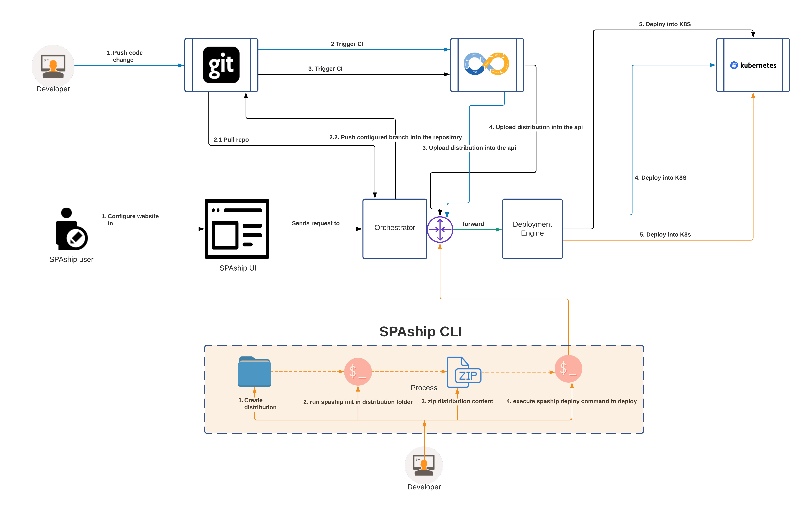

**SPAship** is a combination of multiple components like **URL Namespace**, **Chrome**, **CI/CD Management**, **SSI** and **Pretty URLs**. It reduces the time-to-release cycle time significantly ensuring developers get more time to write code to develop and improve applications.  Overall SPAship contributes to improve the developer experience in a great way by saving good amount of time that can be dedicated to do core development.

The architecture has evolved over the last year from being a bare metal version to become an ***Openshift*** Operator. Few basic components remained the same to deliver the core functionalities and new components are being introduced to support additional features and requirements gathered from end users. 

The new architecture in a nutshell, 
