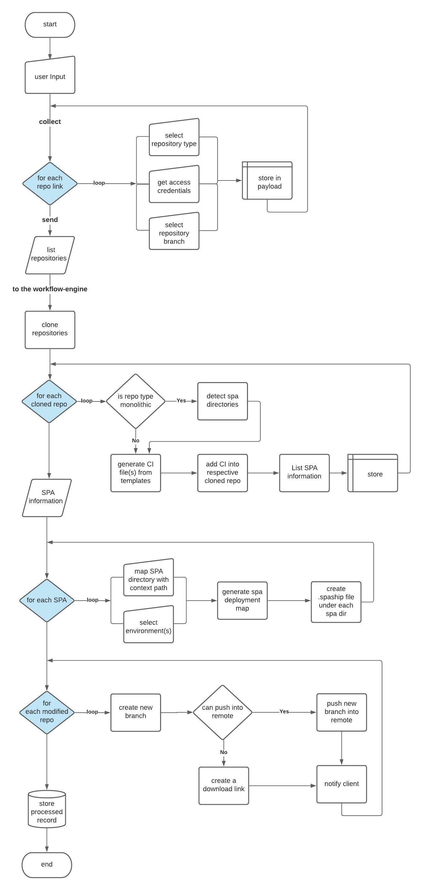

## SPAship Manager - A New Way to managing your SPAs 🙌

### **What is SPAship Manager?**

SPAship Manager is an easy to use web application (GUI) to manage a group of SPA's from a single place, and you can accelerate your deployment time. 

SPAship Manager is a front-end app (web application) that comes under SPAship, and communicates with  Orchestrator for managing and deploying SPAs (Single Page Applications). We have developed this application which will not only provide you the deployment features, also provide you the **real-time** updates and **analytics** for better managing your SPAs. 

We can add web Property to SPAship Manager. It is nothing but a group of related SPAs.

### **Key Features of SPAship manager:**
- Fewer clicks for SPA deployment
- Add as many websites (properties) as you want
- Add flat and multiple repositories for your website
- Real-time alerts of SPA deployment in the activity stream
- Manage all the deployed SPAs and multiple websites in a single place
- Dashboard for all the deployment metrics based on website, SPA, and activity status
- No Code & Command for Deployment (CI-CD integration with Gitlab and Github, which will automatically deploy the SPAs)

### **New Architecture of SPAship Manager :**

### **Why you should start with SPAship Manager?**

- Using SPAship manager you can deploy your application without executing a single line of command just few clicks. You just need to give the required inputs
    1. Provide Repository URL with the Access token (Developer's token)
    2. Select the Working branch, it will list all the directories for your spas
    3. Select your SPAs and you can also provide the expected context name along with the SPAs
    4. Select the required environments (Prod, Dev, Stage, QA)
- As result, it will start the deployment for your SPAs, It'll push the code in the respected repository after authorization (using access token), if authorization fails it'll provide you the .zip file for the project with a new branch (spaship), you can push the codes manually
- It will provide real-time alerts about the SPA Deployment, and after each deployment, the user will receive an aggregated reports for the deployment activities
- Manage all the SPAs at a place, it will provide a separate dashboard for every website and SPAs, user can manage and keep track of all the SPAs
- Fast and Easy Deployment Process (less than 5 mins to deploy SPAs)
Reports and Charts for all the deployment activities