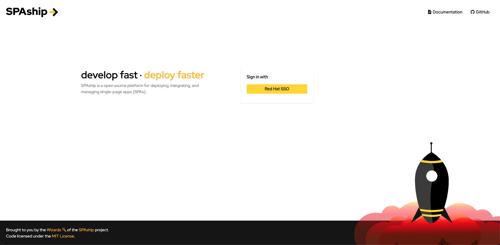
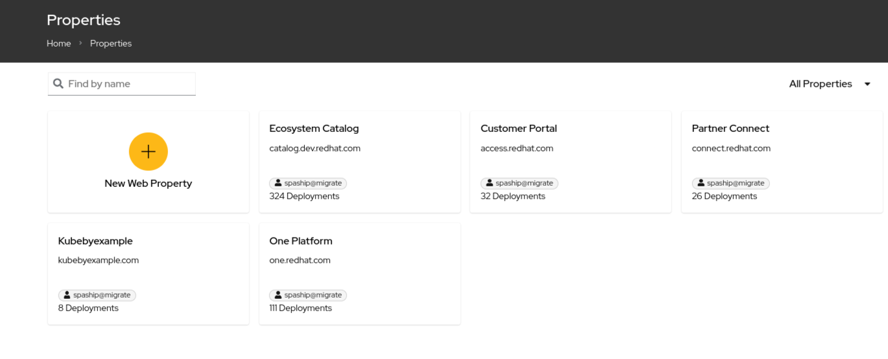
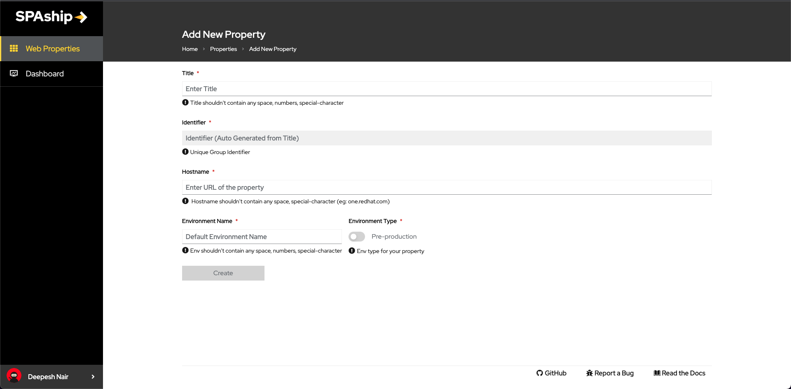
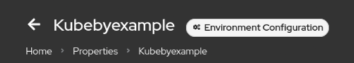
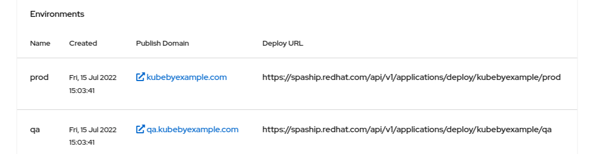
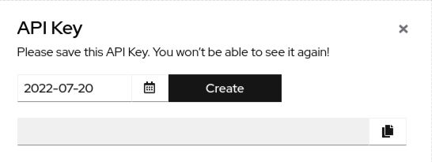

SPAship Manager is **user interface** for managing your ***API Keys*** and ***SPAs*** deployed.

## SPAship user can follow below steps in order to get clarity about SPAship Manager :

### **Step 1: Registering as a SPAship user**
Ensure that you have access to the ***‘spaship-users’*** rover group before getting started with using any Red Hat internal preset SPAship instance. If you are not already in the group and for some reason are not able to join the group yourself, please drop in an email to <spaship-dev@redhat.com>

- Please check the as well [video tutorial](https://drive.google.com/file/d/150OyktZdmqMXKwNS1mDkqIo7ZvgyCCGp/view?usp=sharing) 

### **Step 2: Logging in**
By default, when you try to access the SPA Manager, SPAship will try to automatically log you in using the pre-configured Single Sign On (SSO) service. However, depending upon how your instance is configured, trying to access the SPA Manager can also open up the /login page.

:::info
Currently this is internally deployed version of SPAship, hence a prerequisite is for the user to be on internal VPN network
:::


- Here, you can click upon the Sign in with SSO button to directly log into the SPAship Manager interface.



*SPAship Manager Login Page*


### **Step 3: Obtain a new deploy URL**
- Go to SPAship manager i.e. spaship.redhat.com
- Select your property 
  - Once logged in, you should be redirected to the ***Web properties list page*** as shown in below image.



*SPAship Web properties List Page*

#### OR you can create a new property
- Create a new property


*SPAship Create new Web properties List Page*

#### Follow the same steps thereafter

- Select *Environment Configuration* next to property name



- Copy Deploy URL



### **Step 4: Obtain a new API key**
- Click on Create API Key.



- Select date and click on Create.
:::note
Please note the API key would be visible only once. After the user closes the pop up, they won't be able to see it again
:::
- Copy the API Key for the following methods 
  - Automated Deployment: Jenkins/GitLab CD Pipeline  i.e. `--apikey=$DEPLOY_KEY.`  Check example below. 
  - Manual Deployment: Update .spashiprc.yml. (Find more details in SPAship documentation) 


#### Example
```sh
cd demo-spa

npm install
npm run build

npx @spaship/cli@latest deploy --apikey=$KEY --env=https://deploy-url-from-spaship-manager.com --ref=1.0.0
```

#### After getting the deploy url and API key you can start deploying manually using the Click (next page)

