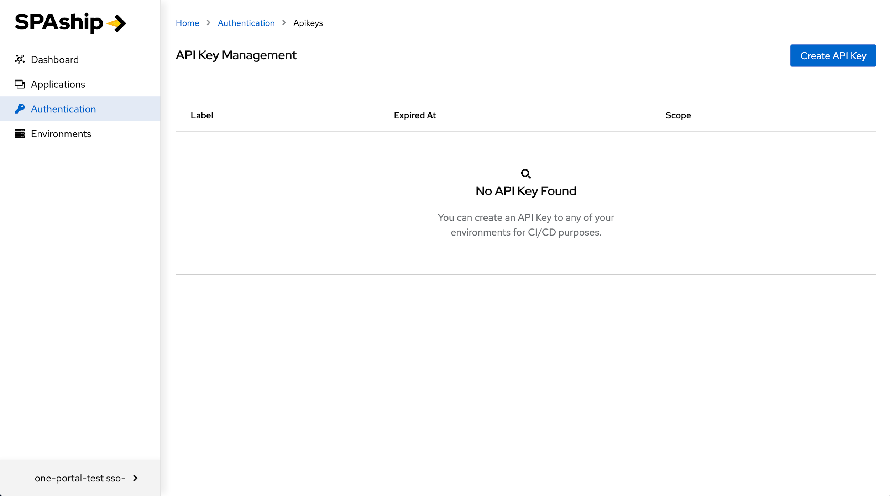
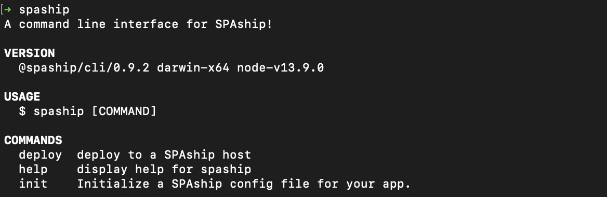
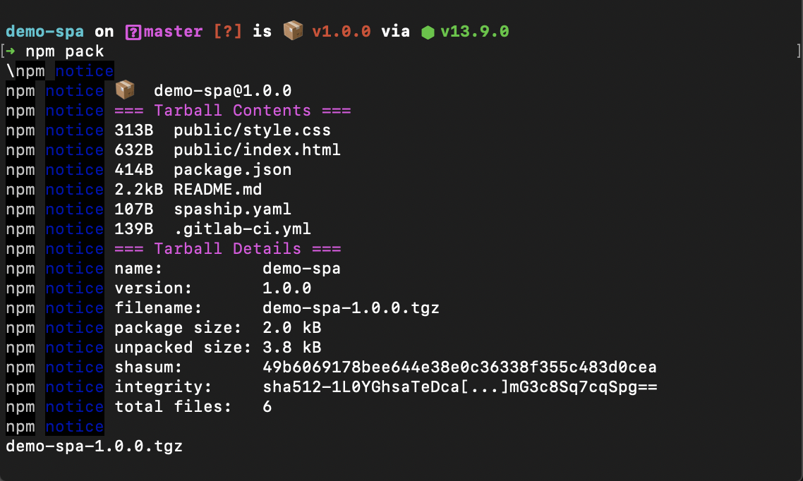

---

# 

So you have a new SPAship instance up and running for deploying your awesome SPAs to your web portal. However, you are new to SPAship and wondering how to get started? Worry not, for this guide is here to help you launch your SPAs in no time.

## SPAship Components

SPAship consists of 7 distinct components:

1. **SPAship CLI:** The command line interface which helps you initialize and deploy your SPAs

2. **SPA Manager:** The user interface for managing your API Keys and Applications.

3. **Router:** The route management service for all your deployed SPAs.

4. **API:** The SPAship API service which handles application deployments and API Key management.

5. **Sync:** An optional service which takes care of auto syncing your Apache SSI components.

6. **Httpd:** The Apache service which hosts all deployed SPAs.

7. **Database:** A MongoDB instance that stores all SPAship data.

## Super Simple Architecture Diagram

## 

## Getting Started

For the purpose of this guide we will assume that your Web Portal is located at [https://](https://awesomeness.io)[awesomeness](https://awesomeness.io)[.io](https://awesomeness.io), i.e. where the SPAship router is configured to run; your SPA Manager instance is running at [https://spaship.awesomeness.io](https://spaship.awesomeness.io) and the SPAship API service is running at [https://api.spaship.awesomeness.io](https://api.spaship.awesomeness.io).

### Step 1: Logging in

By default, when you try to access the SPA Manager, SPAship will try to automatically log you in using the pre-configured Single Sign On (SSO) service. However, depending upon how your instance is configured, trying to access the SPA Manager can also open up the /login page.


Image 1: SPAship Manager Login Page

Here, you can click upon the Sign in with SSO button to directly log into the SPAship Manager interface. However, you can also checkout the SPAship documentation by clicking on the _‘Documentation’_ link or checkout SPAship’s GitHub repository if you are curious to check out the SPAship source code.


Image 2: SPAship Applications List Page

Once logged in, you should be redirected to the Applications list page. Any SPAs that have already been deployed should show up on this page. In case there are no SPAs present, the page would show an empty table with the message "No Application Found".

### Step 2: Creating an API Key

Once you are logged into the SPA Manager, the next thing that you need to do would be to create an API Key for all the environments that you want to be able to deploy your application to. To do this, first click on the "Authentication" link on the left nav bar. This would open up the API Key Management page.



Image 3: SPAship API Key Management Page

To create your first API Key, click the "Create API Key" Button on the top right corner of the page. This should open up a modal asking you to enter some basic details about the API Key.


Image 4: SPAship API Key Creation Modal

This modal asks the following three main questions:

1. **Label:** This is a mandatory field for labeling your API Keys.

2. **Expires At:** If you want the generated API Keys to have an expiration date, you can do so by selecting a date value here. If left empty, the generated API Keys default to a "never" value, meaning that the API Keys never expire.

3. **Environments:** This is to select the environments that you want to create the API Keys for. Selecting multiple environments here generates unique API Keys for each selected environment.


Image 5: SPAship API Key Creation Success

Once you fill up the form and click the "Create API Key" button, the application will generate a set of new API Keys for you and display them for you. You can now copy over your new API Key for safekeeping and use it later for deploying your awesome SPA to your web portal.

**Important:** Please note that this would be the only time that you can see the entire API Key. Once the modal is closed you will NOT be able to view the unencrypted key.


Image 6: SPAship API Key List Updated

Once you close the modal after creating the new set of API Keys, you would be able to see the new API Key set listed in the API Key Management page.


Image 7: SPAship API Details View

You can now click on the "Scope" Cell for your key to view the details of the API Key set. The detailed view lists the “Short Key”, i.e. encrypted unique ID for each Environment along with the “Created At” timestamp. It also provides you the option to delete any particular API Key within the Keyset by clicking on the “Delete” button.

### Step 3: Installing & getting acquainted with the CLI

One of the most handy tools of the SPAship toolchain is the SPAship CLI. It provides you with some of the most simple yet developer friendly means to initialize and deploy your SPAs to your portal.

**Prerequisites:**

You would need NodeJS and NPM installed on your local system.

**Installation:**

To install the SPAship Command Line Interface on your local system run:

\$ npm install -g @spaship/cli

The -g flag installs the CLI globally (accessible from any directory via the command line). To install it under a local directory, simply remove the -g flag.

**Usage:**

Once you have the SPAship CLI installed you would be one step closer to SPA Deployment Awesomeness! Here’s a quick rundown of the CLI commands to help get you started:

To see an overview of the SPAship CLI run: \$ spaship



Image 8: SPAship CLI - Overview

To check which version of the SPAship CLI is currently running: \$ spaship (-v|--version|version)


Image 9: SPAship CLI - Version

To see detailed information about any command: \$ spaship --help [COMMAND]


Image 10: SPAship CLI - init help


Image 10: SPAship CLI - deploy help

Step 4: Setting up your **_.spashiprc.yml_**

_spashiprc_ is a yaml dot file in your \$HOME directory that is used by SPAship to provide an alternative to typing out _--**apikey** `<KEY>`_ and --env _`<URL>`_ arguments every time you run spaship commands. You can use a _spashiprc_ file to define an environment name (like _qa_) along with its URL and API key, after which you can run _spaship deploy --env qa_. The URL and API key will be read from your _spashiprc_ file.

_spashiprc_ files are optional, but very convenient if you plan to do deployments from your dev environment. If your deployments are done by a CI/CD server, you probably don't need a _spashiprc_ file and will be better off using _--env URL_ and _--**apikey** KEY_.

**Important:** As a rule of thumb, _spaship.yaml_ files are consumed by the SPAship API, whereas _spashiprc_ files are consumed by the CLI.

## **_*spashiprc*_** examples

### _spashiprc_ with default environment

This _spashiprc_ file defines a default environment which will be used whenever --env is not provided.

**.spashiprc.yml**

```yml
envs:
  default:
    url: https://localhost:8008
    apikey: 57d5c061-9a02-40fc-a3e4-1eb3c9ae6a12
```

**.spashiprc.yml**

```yml
envs:
  default:
    url: https://localhost:8008
    apikey: 57d5c061-9a02-40fc-a3e4-1eb3c9ae6a12
  qa:
    url: https://qa.mysite.com:8008
    apikey: 57d5c061-9a02-40fc-a3e4-1eb3c8ae2a45
```

Now when you run spaship commands, the --env flag is optional. When it's omitted, the default environment will be used.

```sh
 spaship deploy MyProject-1.0.0.tgz
```

### _spashiprc_ layering example

**\$HOME/.spashiprc.yml**

```yml
envs:
  qa:
    apikey: 57d5c061-9a02-40fc-a3e4-1eb3c9ae6a12
  prod:
    apikey: 70f19422-bf53-44b1-b664-f9b4636bea61
```

**\$HOME/projects/MyProject/.spashiprc.yml**

```yml
envs:
  qa:
    url: https://qa.spaship.io
  prod:
    url: https://spaship.io
```

When you run spaship commands from within \$HOME/projects/MyProject, _both_ of the above _spashiprc_ files will be loaded and merged together, forming a complete definition of URL+API key for each environment.

Such as:

```sh
cd $HOME/projects/MyProject
spaship deploy --env prod MyProject-1.0.0.tgz
```

Step 5: SPA initialization & Deployment

**Getting Started:**
For this example let’s consider the example of an open source NodeJS project consisting of a demo single page application which we would be initializing and deploying via SPAship.

We would be using a generic SPA repository for this example with the following directory structure. If you are interested in learning how we scaffolded it you can check the document linked [here](https://docs.google.com/document/d/1MsHp8runNJbSNiame8Za5NccEVG9M8jGnh7MydPqR-0/edit?usp=sharing).


**SPAship CLI:**

**spaship init:**

The first step to getting started with SPAship is the spaship init command. Executing it without any arguments invokes an interactive prompt which will ask you a few questions and generate a spaship.yaml config file. The answers to these questions can also be passed in as CLI arguments while executing the command. Here’s a screenshot of the command’s help description:


There are 3 ways to use the SPAship CLI to initialize a new SPA with the spaship init command, these are:

Using the interactive mode:


OR

Using long parameters:


OR

Using short parameters


Note the --overwrite flag used in the last two examples is used only when your project already has an existing spaship.yaml file, which we want to overwrite.

**Packaging and deploying:**

**spaship deploy:
**The spaship deploy command allows you to deploy your application to a SPAship host. It works by sending an archive containing a SPA to a SPAship host for deployment. At the moment, the CLI supports .tar.gz/.tgz, .zip, and .tar.bz2 archives.

To start using the deploy command the first thing that you need is a package containing your SPA. For this example, let’s use npm pack:


The next step would be to execute the spaship deploy command to actually deploy your application to a SPAship host. However, prior to running this command, it's highly recommended that you have your spashiprc configured. Please refer to the [SPAship environments & spashiprc](https://docs.google.com/document/d/1sUBPn2fvMXIUDTHH5bGlD-b3qt3tX4xNYG4JqH_d1sU/edit#heading=h.skcg2m54yeru) section. Another important requirement for this step is the API Key required for the deployment. You can create a new API Key by using the SPA Manager’s Authentication section.

Once you have your spashiprc file configured, deploying your application is as easy as running spaship deploy demo-spa-1.0.0.tgz. Internally, this command translates to:

```sh
curl <hostname>/api/v1/applications/deploy -H 'X-API-Key: <API-Key>' -F name=Demo SPA -F path=demo -F upload=@demo-spa-1.0.0.tgz -F ref=v1.0
```


